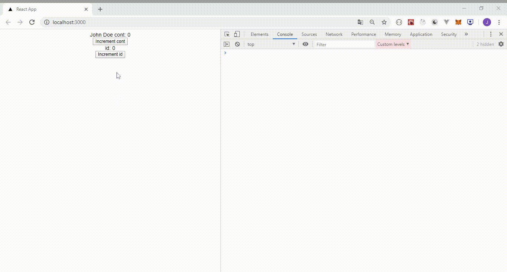

# 17 Why Did You Update

As we have seen in previous examples, using the higher order component _React.memo_ we avoid rendering a component when the same props give the same result. But what if you still see renderings that seem unnecessary? You can use a custom hook that allows you to see what props are causing the component to re-render. In this example we will learn how to implement it.

# Steps

- We will take as a starting point the previous example _17-use-debug-value_. Copy the contents of the project to a new folder and run _npm install_.

```bash
npm install
```

- Let's open the file _demo.tsx_. We will create a parent component and not a child. The child component will only show its props while the parent component has two displayed state variables and two buttons (these buttons increase the value of the variables);

_./src/demo.tsx_

```tsx
import React from "react";

export const MyComponent = () => {
  const [cont, setCont] = React.useState(0);
  const [id, setId] = React.useState(0);

  const name = {
    firstname: 'John',
    lastname: 'Doe',
  };

  return(
    <div>
      <div>
        <MyChildComponent name={name} cont={cont} />
        <button onClick={() => setCont(cont + 1)}>Increment cont</button>
      </div>

      <div>
        <div>id: {id}</div>
        <button onClick={() => setId(id + 1)}>Increment id</button>
      </div>
    </div>
  );
};

interface Name {
  firstname: string;
  lastname: string;
}

interface Props {
  name: Name,
  cont: number,
}

export const MyChildComponent: React.FC<Props> = React.memo(props => {
  
  return(
    <div>
      {props.name.firstname} {props.name.lastname} cont: {props.cont}
    </div>
  );
});
```

- Now we have to add our custom hook _useWhyDidYouUpdate_ and use it inside _MyChildComponent_. This hook receives the props of a component and checks if they have changed.

_./src/demo.tsx_

```diff
import React from "react";

export const MyComponent = () => {
  const [cont, setCont] = React.useState(0);
  const [id, setId] = React.useState(0);

  const name = {
    firstname: 'John',
    lastname: 'Doe',
  };

  return(
    <div>
      <div>
        <MyChildComponent name={name} cont={cont} />
        <button onClick={() => setCont(cont + 1)}>Increment cont</button>
      </div>

      <div>
        <div>id: {id}</div>
        <button onClick={() => setId(id + 1)}>Increment id</button>
      </div>
    </div>
  );
};

export const MyChildComponent = React.memo(props => {
+ useWhyDidYouUpdate('MyChildComponent', props);
  return(
    <div>
      {props.name.firstname} {props.name.lastname} cont: {props.cont}
    </div>
  );
});

+// Hook
+function useWhyDidYouUpdate(name, props) {
+  // Get a mutable ref object where we can store props ...
+  // ... for comparison next time this hook runs.
+  const previousProps = React.useRef();
+
+ React.useEffect(() => {
+    if (previousProps.current) {
+      console.log(previousProps.current);
+      // Get all keys from previous and current props
+      const allKeys = Object.keys({
+        ...(previousProps.current as any),
+        ...props,
+      });
+
+      // Use this object to keep track of changed props
+      const changesObj = {};
+      // Iterate through keys
+      allKeys.forEach((key) => {
+        // If previous is different from current
+        if (
+          previousProps &&
+          previousProps.current &&
+          previousProps.current[key] !== props[key]
+        ) {
+          // Add to changesObj
+          changesObj[key] = {
+            from: previousProps.current[key],
+            to: props[key],
+          };
+        }
+      });
+
+      // If changesObj not empty then output to console
+      if (Object.keys(changesObj).length) {
+        console.log("[why-did-you-update]", name, changesObj);
+      }
+    }
+
+    // Finally update previousProps with current props for next hook call
+    previousProps.current = props;
+  });
+}
```
- Start the example to test the hook.

```bash
npm start
```

- If you open the browser console, you will check that our custom hook launches a message whenever the _Increment cont_ button is clicked. This is expected, but when the _Increment id_ button is pressed our hook also displays a message in the console log. Why? Because the variable _name_ is inside _MyComponent_ and this component is re-rendered every time the user clicks the _Increment id_ button. This button updates the state variable _id_ and whenever the state of a component is updated, it is rendered again (generating a new variable _name_).


- Thanks to our custom hook we have realized that the variable _name_ should be outside of _MyComponent_. If we modify _demo.tsx_ by putting the variable _name_ outside the parent component, the hook _useWhyDidYouUpdate_ will only launch a message in the console log when the button _Increment cont_ is clicked.

_./src/demo.tsx_

```diff
import React from "react";

+ const name = {
+   firstname: 'John',
+   lastname: 'Doe',
+ };

export const MyComponent = () => {
  const [cont, setCont] = React.useState(0);
  const [id, setId] = React.useState(0);

- const name = {
-   firstname: 'John',
-   lastname: 'Doe',
- };
-
  return(
    <div>
      <div>
        <MyChildComponent name={name} cont={cont} />
        <button onClick={() => setCont(cont + 1)}>Increment cont</button>
      </div>

      <div>
        <div>id: {id}</div>
        <button onClick={() => setId(id + 1)}>Increment id</button>
      </div>
    </div>
  );
};

interface Name {
  firstname: string;
  lastname: string;
}

interface Props {
  name: Name;
  cont: number;
}

export const MyChildComponent = React.memo(props => {
  useWhyDidYouUpdate('MyChildComponent', props);
  return(
    <div>
      {props.name.firstname} {props.name.lastname} cont: {props.cont}
    </div>
  );
});
```



# About Basefactor + Lemoncode

We are an innovating team of Javascript experts, passionate about turning your ideas into robust products.

[Basefactor, consultancy by Lemoncode](http://www.basefactor.com) provides consultancy and coaching services.

[Lemoncode](http://lemoncode.net/services/en/#en-home) provides training services.

For the LATAM/Spanish audience we are running an Online Front End Master degree, more info: http://lemoncode.net/master-frontend